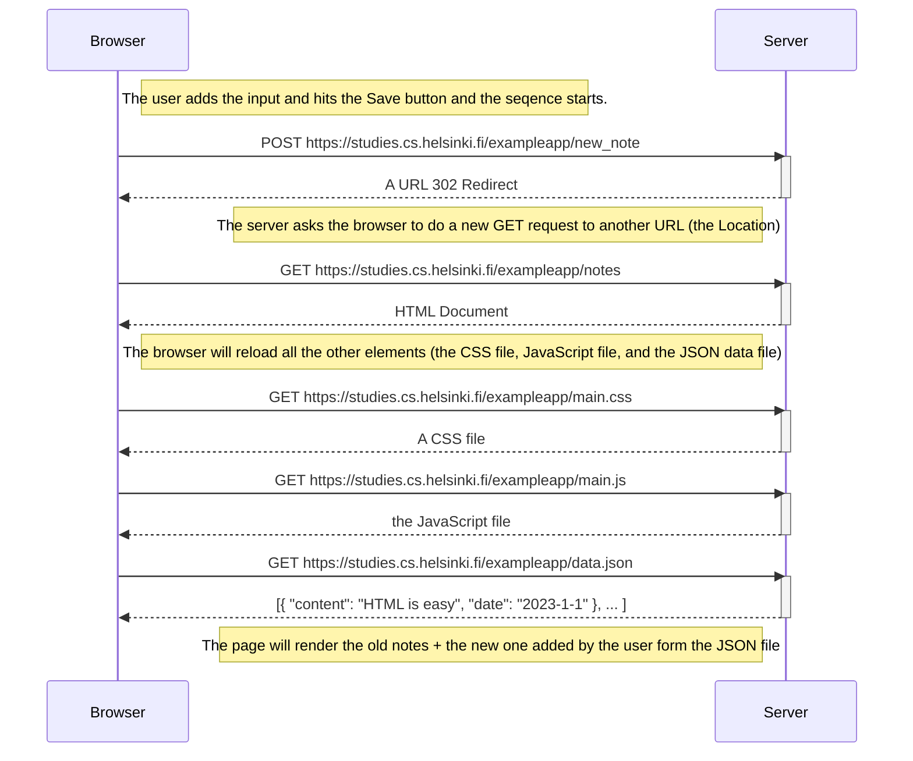
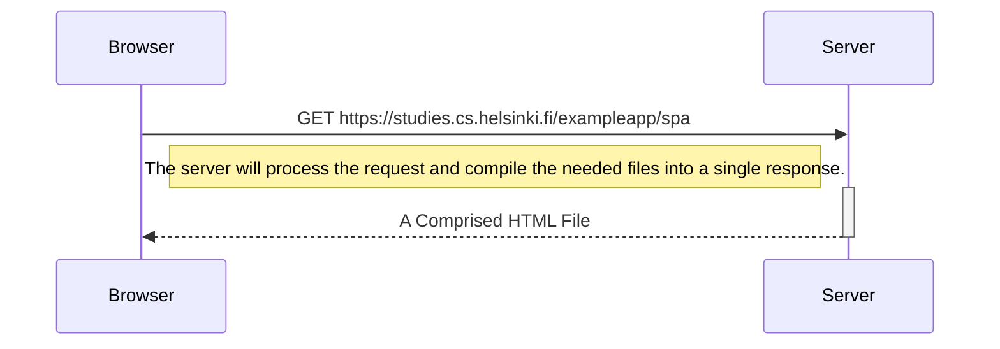
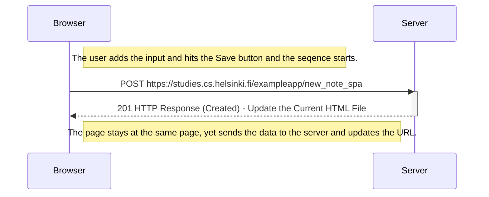

# Fullstack Part 0 - Exercises

I wrote here the exercises for the firts set of assignments at the open full-stack course from University of Helsinki. This file containes the three sequence diagrams for exercises 0.4, 0.5, and 0.6. At exercises 0.1, 0.2, 0.3, I have read the tutorials and marked them at the submission system.

  

## Ex-0.4: New note diagram

**Prompt:** Create a diagram depicting the situation where the user creates a new note on the page https://studies.cs.helsinki.fi/exampleapp/notes by writing something into the text field and clicking the Save button.

  

  

## Ex-0.5: Single page app diagram

**Prompt:** Create a diagram depicting the situation where the user goes to the single-page app version of the notes app at https://studies.cs.helsinki.fi/exampleapp/spa.

 

 

**Description:** It is clearly stated that, "SPA-style websites don't fetch all of their pages separately from the server like our sample application does, but instead comprise only one HTML page fetched from the server, the contents of which are manipulated with JavaScript that executes in the browser." This shows that the server will do most of the work and the browser will only get the final resutl as a single HTML file containing everything the browser needed. 

  

## Ex-0.6: New note in Single page app diagram

**Prompt:** Create a diagram depicting the situation where the user creates a new note using the single-page version of the app.

  

 

**Description:** Once the user hits the Save button, the browser will send a POST requset to the server where the JavaScript has created the data and pushed it to the server. Preventing the regular way of handling forms, the JavaScript file sends the data using the XMLHttpRequest method as a "application/json". This way, the server understands that the only thing that needs render is the JSON data and the all other things compiled into the HTML file would stay the same. The browser rerenderds the HTML page with the specified modifications.
